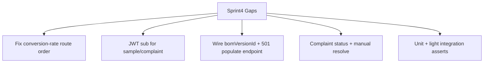

# Sprint 4 Orders — Gap Completion Plan

> Backend-only. Closes remaining gaps vs Sprint 4 quotations / samples / complaints / CAPA tasks.  
> Does **not** rebuild those modules from scratch. Full BOM cost calculation stays deferred until Manufacturing (Sprint 9).

**Status:** Ready to implement  
**Baseline:** Nested controllers + services already shipped under `/api/v1/orders/:orderId/...`

---

## Scope & locked decisions

| Decision | Choice |
|---|---|
| BOM cost auto-populate | Keep `NotImplementedException` (501) until Manufacturing/BOM; still expose endpoint + store `bomVersionId` |
| Deletes | No hard deletes. Complete missing **status/workflow** only |
| Auth identity | Pass `@CurrentUser().sub` into services; never write `'system'` into UUID columns |
| Frontend | Out of scope |

---

## Current gap inventory

| # | Gap | Evidence | Severity |
|---|---|---|---|
| 1 | Conversion-rate route shadowed by `:quotationId` | [`quotations.controller.ts`](../../src/modules/orders/controllers/quotations.controller.ts) — `GET conversion-rate` declared after `GET :quotationId` | High (broken API) |
| 2 | `'system'` written into UUID FKs | Sample approve + complaint create use `CorrelationStore?.userId ?? 'system'` | High (runtime / DB) |
| 3 | `bomVersionId` never accepted on DTOs; populate stub has no HTTP surface | [`quotations.dto.ts`](../../src/modules/orders/dto/quotations.dto.ts); `autoPopulateCostFromBom` exists but unused | Medium |
| 4 | Complaint workflow incomplete | Only create + root-cause patch; no status transitions; zero-CAPA cannot resolve via API | Medium |
| 5 | Conversion-rate filters unused | Service accepts `buyerId` / date range; controller ignores them | Low |

**Intentional deferral:** Real BOM × rate cost fill (Sprint 9 Manufacturing).

---

## 1. Fix conversion-rate KPI route

**Problem:** Nest matches `GET .../quotations/conversion-rate` as `quotationId = "conversion-rate"`.

**Work:**
1. Move `GET conversion-rate` **above** all `:quotationId` routes in [`quotations.controller.ts`](../../src/modules/orders/controllers/quotations.controller.ts).
2. Add `ConversionRateQueryDto` (`buyerId?`, `from?`, `to?`) and pass filters into `QuotationsService.getConversionRate()`.
3. Keep permission `orders:read` and `@AuditTable('ord.quotations')`.

**Acceptance:** `GET /api/v1/orders/:orderId/quotations/conversion-rate` returns `{ total, won, rate }` (not 404/422 from UUID pipe).

**Estimate:** ~1h

---

## 2. Replace `'system'` UUID fallbacks with `@CurrentUser()`

**Problem:** `approved_by` / `raised_by` are `@db.Uuid`; `'system'` is not a UUID.

**Work:**
1. [`samples.controller.ts`](../../src/modules/orders/controllers/samples.controller.ts): inject `@CurrentUser() user: JwtPayload`; call `approveSample(id, user.sub)`; throw `UnauthorizedException` if `sub` missing.
2. [`complaints.controller.ts`](../../src/modules/orders/controllers/complaints.controller.ts) + [`complaints.service.ts`](../../src/modules/orders/services/complaints.service.ts): change `create(orderId, dto, userId)`; require UUID from controller; remove CorrelationStore `'system'` fallback.
3. Mirror order-confirm pattern in [`orders.controller.ts`](../../src/modules/orders/controllers/orders.controller.ts).
4. Update unit tests that mocked CorrelationStore for these paths.

**Acceptance:** Sample approve and complaint create always persist a real user UUID; missing `sub` → 401.

**Estimate:** ~1.5h

---

## 3. Quotation `bomVersionId` + populate-from-bom (501)

**Problem:** Column exists; create never stores it; stub has no route.

**Work:**
1. Add optional `@IsUUID() bomVersionId?` to `CreateQuotationDto` / `UpdateQuotationDto`; persist on create and draft-only update.
2. Add `POST /orders/:orderId/quotations/:quotationId/populate-from-bom` with body `{ bomVersionId: string }` calling `autoPopulateCostFromBom`.
3. Leave stub throwing `NotImplementedException` → **501** until Manufacturing/BOM.
4. Swagger note: real cost fill depends on Sprint 9 BOM / cost sheets.
5. Do **not** invent fake BOM cost math in Orders.

**Acceptance:** Create/update can store `bomVersionId`; populate endpoint returns 501 with clear message.

**Estimate:** ~2h

---

## 4. Complaint status workflow + zero-CAPA resolve

**Problem:** No `open → under_investigation`; CAPA auto-close only when CAPA count &gt; 0, so zero-CAPA complaints stay open forever via API.

**Work:**
1. Add `UpdateComplaintStatusDto` with `status: 'open' | 'under_investigation' | 'resolved'`.
2. Allowed transitions:
   - `open` → `under_investigation`
   - `open` | `under_investigation` → `resolved`
   - Forbid any transition from `resolved`
3. `PATCH /orders/:orderId/complaints/:complaintId/status`.
4. On `resolved`: set `resolvedAt`; emit `ComplaintResolvedEvent` (same event as CAPA auto-close in [`capa-actions.service.ts`](../../src/modules/orders/services/capa-actions.service.ts)).
5. Keep CAPA auto-close logic unchanged; root-cause patch rules unchanged.

**Acceptance:** Complaint can be investigated and manually resolved without CAPA; invalid transition → 422.

**Estimate:** ~2.5h

---

## 5. Tests

| Area | Coverage |
|---|---|
| Conversion rate | Path returns KPI shape; not captured by `:quotationId` |
| Sample approve / complaint create | Uses real UUID `sub`; rejects missing user |
| Quotation DTO / populate | Accepts `bomVersionId`; populate → 501 |
| Complaint status | Valid transitions; resolve sets `resolvedAt` + event; invalid → 422 |

**Command:** `npm test -- --selectProjects unit --testPathPattern=orders`  
(+ targeted integration if containers available)

**Estimate:** ~2h

---

## Implementation order

| Step | Item | Depends on |
|---|---|---|
| 1 | Conversion-rate route + query DTO | — |
| 2 | `@CurrentUser` for sample / complaint | — (parallel with 1) |
| 3 | `bomVersionId` DTO + 501 endpoint | — (parallel with 1–2) |
| 4 | Complaint status + manual resolve | Event already exists |
| 5 | Unit / integration asserts | 1–4 |

**Total estimate:** ~9h

---

## Out of scope

- Real BOM / cost-sheet calculation (Sprint 9 Manufacturing)
- Procurement Sprint 5
- Hard-delete endpoints for quotations / samples / complaints
- Frontend Sprint 4 tabs
- Changing CAPA CRUD / due-date validation already covered by TC-ORD-U-008

---

## Acceptance checklist

- [ ] `GET /api/v1/orders/:orderId/quotations/conversion-rate` returns KPI JSON (optionally filtered)
- [ ] Sample approve and complaint create never write non-UUID `'system'`
- [ ] Quotation create/update can store `bomVersionId`
- [ ] `POST .../populate-from-bom` returns 501 until BOM exists
- [ ] Complaint can move to `under_investigation` and be manually `resolved` without CAPA
- [ ] Existing Sprint 4 unit suites still pass

---

## Key files

| File | Change |
|---|---|
| `src/modules/orders/controllers/quotations.controller.ts` | Reorder routes; query DTO; populate-from-bom |
| `src/modules/orders/dto/quotations.dto.ts` | `bomVersionId`; conversion-rate + populate DTOs |
| `src/modules/orders/services/quotations.service.ts` | Persist `bomVersionId` (stub unchanged) |
| `src/modules/orders/controllers/samples.controller.ts` | `@CurrentUser()` |
| `src/modules/orders/controllers/complaints.controller.ts` | `@CurrentUser()`; status PATCH |
| `src/modules/orders/services/complaints.service.ts` | `userId` arg; `updateStatus` |
| `src/modules/orders/dto/complaints.dto.ts` | `UpdateComplaintStatusDto` |
| `src/modules/orders/**/*.spec.ts` | Matching unit coverage |
