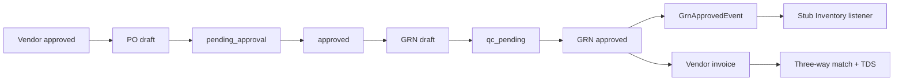

# Sprint 5 — Procurement Backend Implementation Plan

> Vendors, POs, GRN, Vendor Invoices — backend only  
> Status: Ready to implement  
> Baseline: Empty [`src/modules/procurement/`](../../src/modules/procurement/procurement.module.ts) shell; thin Prisma `Vendor` / `PurchaseOrder` stub only

Follow Orders patterns: nested controllers, `@Permissions`, `DocNumberService`, post-commit `EventEmitter2` events, RFC 7807 errors.

---

## Locked decisions

| Decision | Choice |
|---|---|
| Schema source of truth | Expand Prisma toward [`docs/design/OK_Footwear_ERP_Schema.sql`](../design/OK_Footwear_ERP_Schema.sql) `prc` section; replace thin stub |
| Inventory / `GrnApprovedEvent` | Emit event + **stub** Inventory `@OnEvent` listener (log only). Real stock posting = Sprint 6 |
| GL AP posting | Leave `gl_entry_id` null; stub AP journal until Finance |
| Purchase requisitions / tenders | Out of scope for this sprint’s task list |
| Frontend | Out of scope |



---

## Current state

| Area | Status |
|---|---|
| `ProcurementModule` | Empty shell |
| Prisma `prc` | Thin unused stub (`Vendor`, `PurchaseOrder`, `POStatus` enum) — **diverges** from design |
| Design SQL `prc` | Full vendors → PO → GRN → invoices (no `gr_line_photos`) |
| `DocNumberService` | Ready (`PO` / `GRN` prefixes documented) |
| Storage / S3 | Stub module; AWS config exists |
| Email | BullMQ `email-queue` (compliance pattern); MailerModule stub |
| PO thresholds | Docs only (`<50k` / `<500k` / `<5M` / `≥5M`) — no env yet |

---

## 1. Schema migration (`prc`) — ~3h

Replace stub models in [`prisma/schema.prisma`](../../prisma/schema.prisma); add Prisma migration.

| Table | Notes |
|---|---|
| `vendor_categories` | `name`, `code` unique |
| `vendors` | Design shape: `vendor_code`, `type`, `status` (`approved`/`blacklisted`/`under_review`), `rating`, bank/TIN, `created_by`; GIN trigram on `name` |
| `purchase_orders` | Status TEXT machine (below); `total_amount`, `delivery_date`, `approved_by/at`, `created_by` |
| `po_lines` | `item_id` UUID (soft FK until Inventory); qty/price/uom; `received_qty` |
| `goods_receipts` | `grn_number`, `po_id`, status, `received_by`, `approved_by/at` |
| `gr_lines` | CHECK `accepted_qty + rejected_qty <= received_qty` |
| `gr_line_photos` | **Define now (plan-only in docs):** `id`, `gr_line_id`, `s3_key`, `content_type`, `uploaded_by`, `created_at` |
| `vendor_invoices` | gross/tds/net/paid, status, `grn_id`, nullable `gl_entry_id` |

**Breaking:** Drop stub `POStatus` enum in favor of design TEXT statuses. Stub tables are unused by APIs.

**Verify** `sys.document_sequences` has `PO` and `GRN` prefixes.

**Defer:** `approved_vendor_items`, `purchase_requisitions`, `pr_lines`.

---

## 2. Module layout — foundation

Mirror Orders under `src/modules/procurement/`:

```
procurement/
  procurement.module.ts
  controllers/   # vendors, vendor-categories, purchase-orders, po-lines,
                 # goods-receipts, gr-lines, vendor-invoices
  services/      # vendors, purchase-orders, goods-receipts, vendor-invoices, po-approval
  dto/
  events/        # grn-approved.event.ts
  state/         # po-state-machine.ts, grn-state-machine.ts
```

- Reuse [`DocNumberService`](../../src/modules/orders/services/doc-number.service.ts) (import `OrdersModule` export, or extract to `@shared` if coupling is painful).
- Register BullMQ `email-queue` like [`compliance.service.ts`](../../src/modules/system/services/compliance.service.ts).
- Seed permissions: `procurement:read|create|update|approve|delete` (match existing RBAC seed style).

---

## 3. VendorsService — ~3h

- CRUD + list (trigram search, status filter); category CRUD.
- **Enforcement:** PO create only when `vendor.status === 'approved'`; reject `blacklisted` (and default-block `under_review`) — **TC-PRC-U-002**.
- **`rating`:** After GRN approve, recompute as average accepted ratio across vendor GRN lines (document formula in service).

---

## 4. PurchaseOrdersService + approval — ~4h + ~3h

**PO status machine**

```
draft → pending_approval → approved → partially_received | received
draft | pending_approval → cancelled
```

- Draft create/update lines; `total_amount = Σ(ordered_qty × unit_price)` on line changes — **TC-PRC-U-001**.
- Submit → `pending_approval`; required approver role from config:

| Amount (BDT) | Role |
|---|---|
| `< 50_000` | line_manager |
| `< 500_000` | manager |
| `< 5_000_000` | finance |
| `≥ 5_000_000` | md |

- Approve/reject: `@CurrentUser()` + permission; reject requires reason; set `approved_by/at` on approve.
- Enqueue `email-queue` on submit / approve / reject (poNumber, amount, id).
- Sprint 5 = single threshold band → role (not a multi-hop chain unless already needed).

---

## 5. GoodsReceiptsService + photos + event — ~4h + ~1h

- Create GRN against `approved` / `partially_received` PO; lines from `po_lines`.
- Per line: validate `accepted + rejected ≤ received` — **TC-PRC-U-005** (+ DB CHECK).
- Status: `draft → qc_pending → approved | rejected`.
- **Photos:** Minimal Storage (MinIO/S3 via [`aws.config.ts`](../../src/shared/config/aws.config.ts)); persist `s3_key` on `gr_line_photos`.
- **On approve (tx):** update GRN; bump PO line `received_qty`; set PO `partially_received` / `received`; recompute vendor rating; **post-commit** emit `GrnApprovedEvent` — **TC-PRC-U-004**.

**Event payload**

```ts
{ grnId: string; lines: Array<{ itemId: string; warehouseId: string; acceptedQty: number; unitCost: number }> }
```

`warehouseId`: **required on approve DTO** until Inventory owns defaults.

**Inventory stub:** `@OnEvent('grn.approved')` logs payload; no stock write (Sprint 6 replaces).

---

## 6. VendorInvoicesService — ~4h

- Create invoice linked to vendor + approved GRN.
- **Three-way match:** invoice `gross_amount` vs PO/GRN accepted value within `PRC_INVOICE_MATCH_TOLERANCE_PCT` — reject over tolerance (**TC-PRC-U-003**).
- **TDS:** `PRC_TDS_RATE_PCT` → `tds_amount`; `net_payable = gross - tds`.
- Payments: update `paid_amount` / status `pending → partial → paid`; support `disputed` / `cancelled`.
- **GL:** no journal; `gl_entry_id` stays null (Finance later).

---

## 7. Controllers — ~3h

| Area | Routes (`/api/v1`) |
|---|---|
| Categories | `GET/POST /procurement/vendor-categories` |
| Vendors | CRUD `/procurement/vendors` |
| POs | `/procurement/purchase-orders` + `POST :id/submit\|approve\|reject` |
| PO lines | nested `/procurement/purchase-orders/:poId/lines` |
| GRNs | `/procurement/goods-receipts` + QC submit / approve / reject |
| GR lines / photos | nested lines + `POST .../lines/:lineId/photos` |
| Invoices | `/procurement/vendor-invoices` + match + record payment |

`JwtAuthGuard` + `RbacGuard`; `@AuditTable` on approve/reject/invoice match.

---

## 8. Config (`ProcurementConfig` + Joi)

| Env | Default |
|---|---|
| `PRC_PO_THRESHOLD_LINE_MGR` | `50000` |
| `PRC_PO_THRESHOLD_MANAGER` | `500000` |
| `PRC_PO_THRESHOLD_FINANCE` | `5000000` |
| `PRC_INVOICE_MATCH_TOLERANCE_PCT` | `2` |
| `PRC_TDS_RATE_PCT` | (set from BD policy / env) |
| AWS / S3_* | existing |

---

## 9. Tests

| ID | Coverage |
|---|---|
| TC-PRC-U-001 | PO total from lines |
| TC-PRC-U-002 | Blacklisted vendor → PO create fails |
| TC-PRC-U-003 | Invoice over tolerance rejected |
| TC-PRC-U-004 | `GrnApprovedEvent` on GRN approve |
| TC-PRC-U-005 | accepted+rejected ≤ received |
| Light integration | Vendor → PO approve → GRN approve emits event (testcontainers if feasible) |

Shared security IDs (AUTHZ-004, INJ-001/002): implement only if not already owned elsewhere.

---

## Implementation order

1. Prisma migration + client generate  
2. Module skeleton, DTOs, config, permissions seed  
3. Vendors + categories  
4. PO service + state machine + approval + email queue  
5. Minimal Storage + GRN + photos + event + stub Inventory listener  
6. Vendor invoices (match + TDS + payment)  
7. Controllers + TC-PRC-U-001…005  
8. Rebuild `ok-nestjs` for local Docker verify  

**Listed backend estimate:** ~25h · **Realistic with migration/storage/tests:** ~32–36h

---

## Acceptance checklist

- [ ] Full `prc` schema migrated; stub `POStatus` gone  
- [ ] Vendors CRUD; blacklisted cannot get POs  
- [ ] PO totals, threshold approval, email-queue on workflow steps  
- [ ] GRN qty rules; photos stored; approve emits `GrnApprovedEvent`; Inventory stub receives it  
- [ ] Invoice three-way match + TDS; GL not posted  
- [ ] Controllers nested as specified; TC-PRC-U-001…005 pass  

---

## Out of scope

Frontend Sprint 5 pages; purchase requisitions; real Inventory stock trigger (Sprint 6); Finance GL journals; quotation BOM cost fill; tenders.
