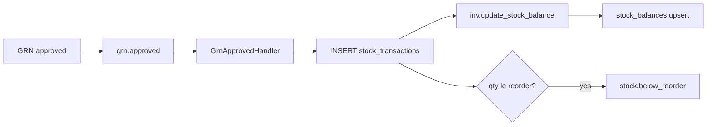

# Sprint 6 — Inventory Backend Implementation Plan

> Stock items, warehouses, transactions, balances, counts, stock summary — backend only  
> Status: Implemented  
> Baseline: Stub [`InventoryModule`](../../src/modules/inventory/inventory.module.ts) with [`GrnApprovedStubListener`](../../src/modules/inventory/listeners/grn-approved.stub.listener.ts); thin Prisma `Warehouse` / `StockItem` only

Follow Procurement / Orders patterns: nested controllers, `@Permissions`, `DocNumberService`, post-commit `EventEmitter2` events, RFC 7807 errors, append-only ledger via `$queryRaw` for partitioned tables.

---

## Locked decisions

| Decision | Choice |
|---|---|
| Schema source of truth | Align `inv` to [`docs/design/OK_Footwear_ERP_Schema.sql`](../design/OK_Footwear_ERP_Schema.sql) (~805–935 + MV ~1949); **ALTER** existing `warehouses` / `stock_items` (do not drop) |
| Partitioned ledger | `stock_transactions` = **raw SQL only** (same rule as `sys.audit_logs`); no Prisma model; inserts/reads via `$queryRaw` |
| Partition UNIQUE | PG requires unique keys to include the partition key → `UNIQUE (txn_number, txn_date)` (not design’s invalid standalone `UNIQUE (txn_number)`). Global uniqueness still via `sys.next_doc_number('STXN')` |
| Prisma models | Expand `Warehouse`, `StockItem`; add `StockBalance`, `StockCount`, `StockCountLine`. **No** `StockTransaction` model |
| Column rename | `unit_of_measure` → `uom` (Prisma `unitOfMeasure` → `uom`); add warehouse `type` and design stock-item fields |
| Cross-schema FKs | Add `prc.po_lines.item_id → inv.stock_items(id)`. Defer `mfg.bom_lines` / PR lines until those tables exist |
| Balances | **Never** app-write `stock_balances`; only trigger `inv.update_stock_balance`. Service pre-checks outbound qty (422); DB `chk_balance_non_negative` is the backstop |
| GRN handoff | Replace stub with `GrnApprovedHandler` → `recordMovement()` per line (`txn_type='grn'`, `direction=+1`, `source_module='prc'`) |
| MV refresh | No `@nestjs/schedule`. `StockSummaryService.refresh()` = `REFRESH MATERIALIZED VIEW CONCURRENTLY` + Redis NX lock (compliance pattern); `POST /inventory/stock-summary/refresh` (`inventory:approve`) |
| Doc numbers | Seed `STXN` and `STC` in `sys.document_sequences`; reuse [`DocNumberService`](../../src/modules/orders/services/doc-number.service.ts) |
| Frontend | Out of scope |
| E2E cases | Cover TC-E2E-INV-001/002 as **integration** (HTTP + DB), not browser E2E |



---

## Current state

| Area | Status |
|---|---|
| `InventoryModule` | Stub shell — logs `grn.approved` only |
| Prisma `inv` | Thin `Warehouse` / `StockItem` (no `type`, thin item fields, no ledger) |
| Design SQL `inv` | Full warehouses → items → partitioned transactions → balances → counts + MV |
| Procurement | Post-commit `GrnApprovedEvent` emitted from [`GoodsReceiptsService.approve()`](../../src/modules/procurement/services/goods-receipts.service.ts) |
| Event payload | `{ grnId; lines: [{ itemId, warehouseId, acceptedQty, unitCost }] }` |
| Permissions | Already seeded: `inventory:read\|create\|update\|delete\|approve\|export` |
| Partition precedent | [`20260628000001_sprint2_audit_logs_partition`](../../prisma/migrations/20260628000001_sprint2_audit_logs_partition/migration.sql) |
| Cron / MV | No `@nestjs/schedule` in package.json; closest pattern = Redis-locked `ComplianceService.nightlyCheck()` |

---

## 1. Schema migration (`inv`) — ~3h (+ trigger / CHECK / MV)

Add migration `prisma/migrations/20260806000000_sprint6_inv_schema/` (or next free timestamp). Port from design SQL with the UNIQUE fix.

### 1.1 ALTER existing tables

| Change | Notes |
|---|---|
| `inv.warehouses` | Add `type TEXT NOT NULL DEFAULT 'general'` with CHECK (`raw_material`, `accessories`, `finished_goods`, `packing`, `general`) |
| `inv.stock_items` | Rename `unit_of_measure` → `uom`; tighten `category` CHECK; add `sub_category`, `min_stock`, `max_stock`, `lead_time_days`, `hsn_code`, `created_by`; GIN trigram on `name`; `BEFORE UPDATE` → `sys.set_updated_at()` |

### 1.2 New tables / DB objects

| Object | Notes |
|---|---|
| `inv.stock_transactions` | Append-only ledger; `PARTITION BY RANGE (txn_date)`; yearly children `2025` / `2026` / `2027`; `UNIQUE (txn_number, txn_date)`; qty `> 0`; direction `IN (1, -1)`; txn_type whitelist per design |
| Indexes | Parent: `(item_id, txn_date DESC)`, `(warehouse_id, item_id)`, `(source_module, source_id)` |
| `inv.stock_balances` | PK `(item_id, warehouse_id)`; `CONSTRAINT chk_balance_non_negative CHECK (quantity >= 0)` |
| `inv.update_stock_balance` | AFTER INSERT trigger: upsert balance `qty += direction × qty`; weighted `avg_cost` only when `direction = 1` |
| `inv.stock_counts` | Status: `open` → `counting` → `variance_review` → `approved` \| `cancelled` |
| `inv.stock_count_lines` | Snapshot `system_qty`; `physical_qty`; `variance` GENERATED ALWAYS AS (`physical_qty - system_qty`) STORED |
| `inv.stock_summary` | MATERIALIZED VIEW (design SELECT); `CREATE UNIQUE INDEX idx_mv_stock (item_id)` for CONCURRENTLY |
| FK | `prc.po_lines.item_id → inv.stock_items(id)` |
| Sequences | `INSERT … STXN`, `STC` into `sys.document_sequences` (`ON CONFLICT DO NOTHING`) |

### 1.3 Trigger formula (document in migration comments)

```sql
-- Inbound (direction = 1): weighted avg
avg_cost = ROUND(
  (old_qty * old_avg + NEW.quantity * NEW.unit_cost)
  / NULLIF(old_qty + NEW.quantity, 0), 4)
-- Outbound (direction = -1): avg_cost unchanged
```

### 1.4 Prisma

Update [`prisma/schema.prisma`](../../prisma/schema.prisma):

- Expand `Warehouse` (`type` enum/string)
- Expand `StockItem` (`uom`, design fields, `createdBy`)
- Add `StockBalance`, `StockCount`, `StockCountLine` (+ status enum)
- **Do not** add `StockTransaction`
- Wire relations from balances / counts to items and warehouses

**Verify:** `pg_trgm` already enabled (baseline extensions); `sys.set_updated_at()` exists.

**Defer:** `approved_vendor_items` FKs already pending; `mfg.bom_lines` FK until manufacturing schema lands.

---

## 2. Module layout — foundation

Mirror Procurement under `src/modules/inventory/`:

```
inventory/
  inventory.module.ts
  controllers/   # warehouses, stock-items, stock-transactions,
                 # stock-counts, stock-summary
  services/      # warehouses, stock-items, stock-transactions,
                 # stock-counts, stock-summary
  dto/
  events/        # stock-below-reorder.event.ts
  listeners/     # grn-approved.handler.ts  (replaces stub)
  state/         # stock-count-state-machine.ts
  index.ts
```

- Reuse [`DocNumberService`](../../src/modules/orders/services/doc-number.service.ts) (same import pattern as Procurement).
- Wire `EventEmitter2` + `PrismaService` + Redis (for MV refresh lock).
- Remove [`grn-approved.stub.listener.ts`](../../src/modules/inventory/listeners/grn-approved.stub.listener.ts) when handler ships.
- Permissions already seeded — no new seed required unless roles need Store Officer matrix later.
- Skip dedicated `inventory.config.ts` unless a default appears necessary (prefer zero new env vars).

---

## 3. WarehousesService + Controller — part of ~3h items CRUD

- CRUD; filter by `type` / `isActive`.
- Soft-deactivate preferred over hard delete when balances or counts reference the warehouse.
- `@Permissions('inventory:read|create|update|delete')`.

---

## 4. StockItemsService + Controller — ~3h

- CRUD; **category** filter; GIN trigram search on `name` (buyers / vendors pattern).
- Reorder level config on create/update.
- List/detail: expose live `belowReorder` via `SUM(stock_balances.quantity) <= reorder_level` (use live balances for mutation-time flags; MV for summary GET only).
- Soft-deactivate preferred over hard delete.

---

## 5. StockTransactionsService — ~3h

**Invariant:** INSERT only — never UPDATE / DELETE on the ledger (**TC-INV-U-001**).

### `recordMovement(dto, userId)`

1. Validate item + warehouse active.
2. If `direction === -1`, pre-check available qty on that warehouse (or abort with 422 before hitting CHECK).
3. Inside tx: `DocNumberService.next('STXN')`; `$queryRaw` INSERT into `inv.stock_transactions`.
4. Trigger updates `stock_balances`.
5. Call `checkReorderLevel(itemId)`:
   - SUM all warehouse balances vs item `reorder_level`
   - If `totalQty <= reorderLevel` → emit `stock.below_reorder` / `StockBelowReorderEvent` (**TC-INV-U-002**)
   - Else do not emit (**TC-INV-U-003**)

### `findAll(query)`

Paginated history via `$queryRaw` (filters: `itemId`, `warehouseId`, `txnType`, date range).

**Event payload**

```ts
{ itemId: string; warehouseId?: string; quantity: number; reorderLevel: number; totalQty: number }
```

---

## 6. GrnApprovedHandler — ~3h

Replace stub:

```ts
@OnEvent('grn.approved')
async handle(event: GrnApprovedEvent): Promise<void> {
  for (const line of event.lines) {
    if (line.acceptedQty <= 0) continue;
    await this.stockTx.recordMovement({
      txnType: 'grn',
      direction: 1,
      itemId: line.itemId,
      warehouseId: line.warehouseId,
      quantity: line.acceptedQty,
      unitCost: line.unitCost,
      sourceModule: 'prc',
      sourceId: event.grnId,
      txnDate: /* today or event date */,
    }, /* system or last approver — document choice: system user / event actor */);
  }
}
```

- `created_by`: use a documented system UUID or extend `GrnApprovedEvent` with `approvedBy` if Procurement already has it; prefer extending the event with `approvedBy` if a one-line procurement change is acceptable.
- Idempotency (optional hardening): skip if a txn already exists for `(source_module='prc', source_id=grnId, item_id)` — document if implemented.
- Covers **TC-E2E-INV-001**.

---

## 7. StockCountsService — ~4h

**Status machine**

```
open → counting → variance_review → approved
open | counting | variance_review → cancelled
```

| Step | Behavior |
|---|---|
| Create | Doc number `STC`; snapshot `system_qty` from `stock_balances` for items in warehouse (zero-balance items optional — include active items with qty 0 or only non-zero; **default: all active items with a balance row or qty ≥ 0 in that WH**) |
| Enter counts | Patch lines `physical_qty` / `variance_reason`; status → `counting` |
| Submit review | → `variance_review` |
| Approve | `@Permissions('inventory:approve')`; for each non-zero variance post `adjustment_in` (`+`) or `adjustment_out` (`-`) via `recordMovement`; set `approved_by/at` |
| Cancel | Terminal; no ledger writes |

- Expose `computeVariance(systemQty, physicalQty) => physical - system` for **TC-INV-U-004** (DB generated column remains source of truth on read).
- Covers **TC-E2E-INV-002**.

---

## 8. Stock summary MV + refresh — ~2h

### Materialized view (design)

```sql
-- total_qty, total_value, avg_unit_cost, below_reorder
-- UNIQUE INDEX idx_mv_stock(item_id) required for CONCURRENTLY
```

### StockSummaryService

- `findAll(query)` — `$queryRaw` / Prisma `$queryRaw` against `inv.stock_summary` (paginated, optional `belowReorder` filter).
- `refresh()`:
  1. Redis `SET key NX EX` (e.g. `inv:stock_summary:refresh`, TTL 300s)
  2. If not acquired → no-op / 409
  3. `REFRESH MATERIALIZED VIEW CONCURRENTLY inv.stock_summary`
  4. Release lock (or rely on TTL)

Nightly: k8s CronJob or ops hit `POST /inventory/stock-summary/refresh` (same pattern as compliance — callable method, not Nest `@Cron`).

---

## 9. Controllers + DTOs — ~3h

All under `/api/v1/inventory/…`. `JwtAuthGuard` + `RbacGuard`. `ParseUUIDPipe` on `:id`. ValidationPipe whitelist.

| Area | Routes | Permission |
|---|---|---|
| Warehouses | CRUD `/inventory/warehouses` | read/create/update/delete |
| Stock items | CRUD `/inventory/stock-items` | read/create/update/delete |
| Transactions | `GET/POST /inventory/transactions` | read / create |
| Stock summary | `GET /inventory/stock-summary` | read |
| Summary refresh | `POST /inventory/stock-summary/refresh` | approve |
| Stock counts | CRUD `/inventory/stock-counts` + line PATCH | create/update/read |
| Count workflow | `POST …/:id/submit\|approve\|cancel` | update / approve / update |

`@AuditTable` on count approve / cancel and optional high-risk adjustments.

---

## 10. Tests

Follow unit vs integration split in [`jest.config.ts`](../../jest.config.ts). Specs under `src/__tests__/inventory/`.

| ID | Type | Coverage |
|---|---|---|
| TC-DB-INV-001 | Database | GRN-shaped insert (`direction=+1`) increments balance |
| TC-DB-INV-002 | Database | `production_issue` decrements balance |
| TC-DB-INV-003 | Database | `100 + 50 − 30 = 120` |
| TC-DB-INV-004 | Database | CHECK `chk_balance_non_negative` rejects oversell |
| TC-DB-INV-005 | Database | Weighted avg: 100@10 + 100@20 → avg 15 |
| TC-DB-INV-006 | Database | Stock-out leaves `avg_cost` unchanged |
| TC-DB-MV-002 | Database | After REFRESH, `below_reorder=true` when qty ≤ reorder_level |
| TC-INV-U-001 | Unit | `recordMovement` INSERT only — never update/delete |
| TC-INV-U-002 | Unit | Emit `stock.below_reorder` when balance ≤ reorder |
| TC-INV-U-003 | Unit | No emit when above threshold |
| TC-INV-U-004 | Unit | `variance = physical_qty − system_qty` |
| TC-INV-I-001 | Integration | POST transaction → balance updated (trigger) |
| TC-INV-I-002 | Integration | GET stock-summary returns `total_qty` + `below_reorder` |
| TC-E2E-INV-001 | Integration | Approved GRN (or handler) reflects in balance |
| TC-E2E-INV-002 | Integration | Count submit → approve posts adjustments |

Suggested files:

```
src/__tests__/inventory/
  tc_inv_u_txn.spec.ts          # U-001…003
  tc_inv_u_count.spec.ts        # U-004
  integration/
    tc_db_inv.spec.ts           # DB-INV-001…006 + MV-002
    tc_inv_i.spec.ts            # I-001, I-002
    tc_e2e_inv.spec.ts          # E2E-INV-001, E2E-INV-002
```

---

## Implementation order

1. Prisma migration + client generate (ALTER + partitions + trigger + CHECK + MV + sequences + FK)  
2. Module skeleton, DTOs, state machine  
3. Warehouses + StockItems CRUD (trigram + below-reorder flag)  
4. StockTransactionsService + reorder event + TC-INV-U-001…003  
5. DB trigger tests TC-DB-INV-001…006  
6. GrnApprovedHandler (delete stub) + TC-E2E-INV-001  
7. StockCountsService + TC-INV-U-004 + TC-E2E-INV-002  
8. StockSummaryService + refresh + TC-DB-MV-002 + TC-INV-I-002  
9. Controllers polish + TC-INV-I-001  
10. Rebuild `ok-nestjs` for local Docker verify  

**Listed backend estimate:** ~26h · **Realistic with migration / partitions / tests:** ~34–40h

---

## Acceptance checklist

- [ ] Full `inv` schema: altered warehouses/items; partitioned transactions; balances + CHECK; counts; MV + unique index  
- [ ] Trigger maintains qty + weighted avg; negative stock rejected by CHECK  
- [ ] Stub listener removed; `GrnApprovedHandler` posts `grn` movements  
- [ ] Stock items: category filter, trigram search, reorder config, below-reorder flag  
- [ ] Transactions append-only; `StockBelowReorderEvent` only when ≤ threshold  
- [ ] Stock count workflow; approve posts adjustments  
- [ ] `GET /inventory/stock-summary` from MV; concurrent refresh behind Redis lock  
- [ ] Controllers as specified; TC-DB-INV-001…006, TC-DB-MV-002, TC-INV-U-001…004, TC-INV-I-001…002, TC-E2E-INV-001…002 pass  

---

## Out of scope

Frontend Sprint 6 pages (stock list, balance view, count sheet, warehouse UI, KPI widget); `@nestjs/schedule` package; manufacturing issue/return UIs; multi-warehouse transfer UI beyond `transfer_in` / `transfer_out` txn types if not explicitly API-exposed this sprint; browser E2E; Finance GL from inventory adjustments.
