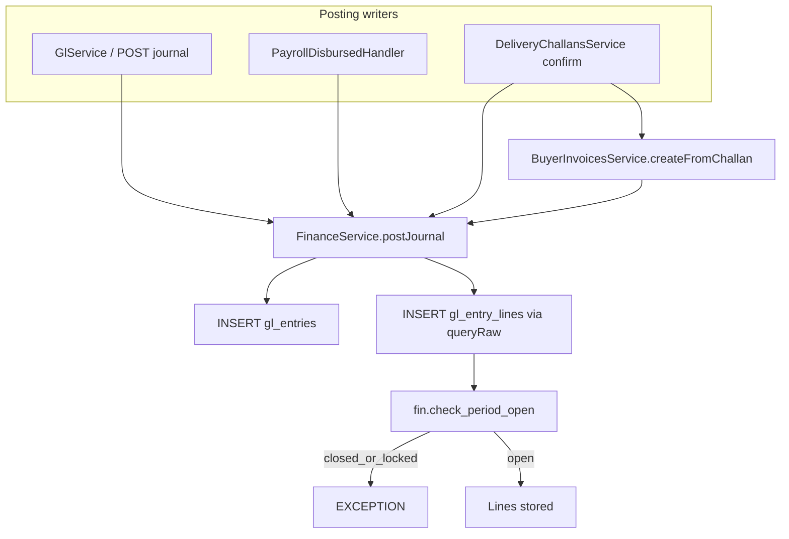

# Sprint 7 — Finance Core Backend Implementation Plan

> GL, Chart of Accounts, periods, bank accounts, delivery challans, buyer AR — **backend only**  
> Status: Implemented  
> Baseline: Empty [`FinanceModule`](../../src/modules/finance/finance.module.ts); thin Prisma `ChartOfAccount` only

Follow Inventory / Procurement patterns: nested controllers under `finance/…`, `@Permissions('finance:…')`, `DocNumberService`, post-commit `EventEmitter2` where needed, RFC 7807 errors, partitioned ledger via `$queryRaw`.

---

## Locked decisions

| Decision | Choice |
|---|---|
| Schema source of truth | Port Sprint 7 tables from [`docs/design/OK_Footwear_ERP_Schema.sql`](../design/OK_Footwear_ERP_Schema.sql) (~941–1066, ~1200–1254); **ALTER** existing CoA to match design (rename `account_name` → `name`, add `account_class`, `is_control`, `currency`) |
| Partitioned ledger | `fin.gl_entry_lines` = **raw SQL only** (same rule as `inv.stock_transactions`); no Prisma model; inserts/reads via `$queryRaw` |
| Partition PK | `PRIMARY KEY (id, entry_date)`; yearly children `2025`/`2026`/`2027` |
| Period trigger | Expand design trigger: block insert when period status IN (`closed`, `locked`) — matches master plan (design SQL only checks `locked`) |
| `department_id` | Store UUID column on lines; **no FK** to `hr.departments` until HR schema exists |
| Doc numbers | Seed `JV`, `DC`, `BINV` in `sys.document_sequences`; generate via [`DocNumberService`](../../src/modules/orders/services/doc-number.service.ts) |
| Service split | `FinanceService.postJournal()` = sole writer of headers + lines; `GlService` = journal queries + trial balance + account balance + period open/close/lock |
| AP (vendor) | **Out of scope** — keep `prc.vendor_invoices.gl_entry_id` null |
| Payroll event | Define `PayrollDisbursedEvent` under HR (producer owns event); Finance `PayrollDisbursedHandler` listens now |
| Bank import | Persist rows in `fin.bank_transactions`; CSV + OFX parsers; reconciles via `is_reconciled` |
| POD photos | Reuse `StorageService`; store key on challan (`pod_photo_key`) |
| Routes | `@Controller('finance/…')` under global `/api/v1` |
| Frontend / tests | Frontend out of scope. Unit/DB/integration TC-FIN* **deferred** |



---

## Current state

| Area | Status |
|---|---|
| `FinanceModule` | Empty shell |
| Prisma `fin` | Thin `ChartOfAccount` + `AccountType` |
| Design SQL | Full CoA → periods → entries → partitioned lines → banks → DC → AR |
| Permissions | Already seeded: `finance:read\|create\|update\|delete\|approve\|export` |
| Vendor invoices | Exist in procurement; GL link stubbed |
| Orders | Confirmed orders available for challan creation |
| HR / payroll | Stub module; no emitter yet |

---

## 1. Schema migration — `prisma/migrations/20260810000000_sprint7_fin_schema/`

### 1.1 ALTER CoA

- Rename `account_name` → `name`
- Add `account_class`, `is_control`, `currency`
- Ensure `BEFORE UPDATE` → `sys.set_updated_at()`

### 1.2 Core GL tables

| Object | Notes |
|---|---|
| `fin.gl_periods` | `(period_year, period_month)` UNIQUE; status `open\|closed\|locked` |
| `fin.gl_entries` | Headers; `entry_number` via `DocNumberService` (`JV`); status `draft\|posted\|reversed` |
| `fin.gl_entry_lines` | Partitioned by `entry_date`; CHECKs `chk_gl_debit_credit` + `chk_gl_nonzero`; **no Prisma model** |
| `fin.check_period_open` | BEFORE INSERT; raise if period `closed` or `locked` |
| `fin.bank_accounts` | Soft-CRUD; `gl_account_id` → CoA |
| `fin.bank_transactions` | Import + reconciliation rows |

### 1.3 AR / Delivery

| Object | Notes |
|---|---|
| `fin.delivery_challans` | Status `draft→dispatched→delivered\|returned`; POD fields + `pod_photo_key` |
| `fin.dc_lines` | FK `order_line_id` |
| `fin.buyer_invoices` | Status `unpaid\|partial\|paid\|disputed`; `gl_entry_id` after post |

### 1.4 Sequences + seed accounts

- Insert `JV`, `DC`, `BINV` into `sys.document_sequences`
- Seed system CoA: Salary Expense (`5100`), Net Salary Payable (`2100`), Trade Receivables (`1200`), Sales Revenue (`4100`)

### 1.5 Prisma models

Add: `GlPeriod`, `GlEntry`, `BankAccount`, `BankTransaction`, `DeliveryChallan`, `DcLine`, `BuyerInvoice`; expand `ChartOfAccount`.  
**Do not** add `GlEntryLine`.

**Defer:** fixed assets, budgets, LCs, `hr.departments` FK, vendor AP GL posting.

---

## 2. Module layout

```
src/modules/finance/
  finance.module.ts
  controllers/   chart-of-accounts, gl-entries, gl-periods,
                 bank-accounts, delivery-challans, buyer-invoices
  services/      finance, gl, chart-of-accounts, bank-accounts,
                 delivery-challans, buyer-invoices
  dto/
  listeners/     payroll-disbursed.handler.ts
  utils/         csv-ofx-parser.ts
src/modules/hr/events/payroll-disbursed.event.ts
```

---

## 3. Core services

### 3.1 `FinanceService.postJournal()`

- Validate ∑debit = ∑credit (else 422)
- Reject if period not `open`
- `$transaction`: create `gl_entries` (posted), `DocNumberService.generate(tx,'JV')`, bulk `$queryRaw` INSERT lines

### 3.2 `GlService`

- Journal list/get (lines via `$queryRaw`)
- Post-only + list/get
- Trial balance / account balance CTEs
- Period workflow: open → close → lock; unlock → closed (`finance:approve`)

### 3.3–3.6 CoA / Bank / Delivery / Buyer invoices

Per master Sprint 7 task table (hierarchy CRUD; CSV/OFX import; createFromOrder + POD + AR on deliver; ageing / collection / dispute).

### 3.7 `PayrollDisbursedHandler`

- `@OnEvent('payroll.disbursed')` → Dr Salary Expense / Cr Net Payable

---

## 4. HTTP surface

| Method | Path | Permission |
|---|---|---|
| CRUD | `/finance/chart-of-accounts` | read/create/update/delete |
| GET/POST | `/finance/gl/entries`, `/finance/gl/entries/:id` | read / create |
| GET | `/finance/gl/trial-balance`, `/finance/gl/account-balance` | read |
| GET + actions | `/finance/gl/periods`, `…/:id/close\|lock\|unlock` | read / approve |
| CRUD + import | `/finance/bank-accounts`, `…/:id/import`, reconcile | read/create/update |
| CRUD + POD | `/finance/delivery-challans` | read/create/update |
| List/ageing/collect | `/finance/buyer-invoices` | read/update |

---

## 5. Out of scope

- Frontend pages
- Sprint 7 test implementation (`TC-FIN-*`, etc.)
- Fixed assets, budgets, LCs
- Vendor AP → GL posting

---

## 6. Acceptance

- [x] Migration applies; CoA altered; partitions + `check_period_open` (closed+locked) live
- [x] `postJournal` enforces balance + open period; lines via `$queryRaw` only
- [x] CoA / GL / periods / bank / DC / AR APIs wired with RBAC
- [x] Confirmed delivery creates AR invoice + GL post
- [x] `PayrollDisbursedHandler` posts salary journal when event fired
- [x] Module JSDoc updated; TypeScript compile clean
